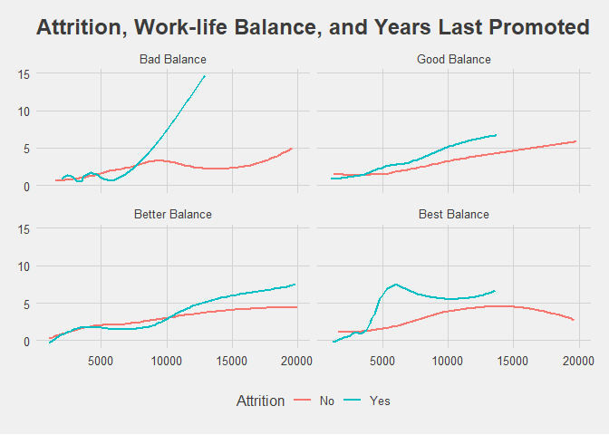

```r
library(knitr)
library(ggplot2)
library(ggthemes)
```

```
## Warning: package 'ggthemes' was built under R version 4.0.2
```

```r
library(scales)
library(openxlsx)
```

# Import data

```r
attrition <- read.csv(file.path('C:/Users/jlbro/OneDrive/R Studio projects/ggplot attrition 1', 'attrition.csv'), stringsAsFactors = TRUE)
```

# Check first 5 rows

```r
head(attrition)
```

```
##   Age Attrition    BusinessTravel DailyRate             Department
## 1  41       Yes     Travel_Rarely      1102                  Sales
## 2  49        No Travel_Frequently       279 Research & Development
## 3  37       Yes     Travel_Rarely      1373 Research & Development
## 4  33        No Travel_Frequently      1392 Research & Development
## 5  27        No     Travel_Rarely       591 Research & Development
## 6  32        No Travel_Frequently      1005 Research & Development
##   DistanceFromHome Education EducationField EmployeeCount EmployeeNumber
## 1                1         2  Life Sciences             1              1
## 2                8         1  Life Sciences             1              2
## 3                2         2          Other             1              4
## 4                3         4  Life Sciences             1              5
## 5                2         1        Medical             1              7
## 6                2         2  Life Sciences             1              8
##   EnvironmentSatisfaction Gender HourlyRate JobInvolvement JobLevel
## 1                       2 Female         94              3        2
## 2                       3   Male         61              2        2
## 3                       4   Male         92              2        1
## 4                       4 Female         56              3        1
## 5                       1   Male         40              3        1
## 6                       4   Male         79              3        1
##                 JobRole JobSatisfaction MaritalStatus MonthlyIncome MonthlyRate
## 1       Sales Executive               4        Single          5993       19479
## 2    Research Scientist               2       Married          5130       24907
## 3 Laboratory Technician               3        Single          2090        2396
## 4    Research Scientist               3       Married          2909       23159
## 5 Laboratory Technician               2       Married          3468       16632
## 6 Laboratory Technician               4        Single          3068       11864
##   NumCompaniesWorked Over18 OverTime PercentSalaryHike PerformanceRating
## 1                  8      Y      Yes                11                 3
## 2                  1      Y       No                23                 4
## 3                  6      Y      Yes                15                 3
## 4                  1      Y      Yes                11                 3
## 5                  9      Y       No                12                 3
## 6                  0      Y       No                13                 3
##   RelationshipSatisfaction StandardHours StockOptionLevel TotalWorkingYears
## 1                        1            80                0                 8
## 2                        4            80                1                10
## 3                        2            80                0                 7
## 4                        3            80                0                 8
## 5                        4            80                1                 6
## 6                        3            80                0                 8
##   TrainingTimesLastYear WorkLifeBalance YearsAtCompany YearsInCurrentRole
## 1                     0               1              6                  4
## 2                     3               3             10                  7
## 3                     3               3              0                  0
## 4                     3               3              8                  7
## 5                     3               3              2                  2
## 6                     2               2              7                  7
##   YearsSinceLastPromotion YearsWithCurrManager
## 1                       0                    5
## 2                       1                    7
## 3                       0                    0
## 4                       3                    0
## 5                       2                    2
## 6                       3                    6
```

# Check structure

```r
str(attrition)
```

```
## 'data.frame':	1470 obs. of  35 variables:
##  $ Age                     : int  41 49 37 33 27 32 59 30 38 36 ...
##  $ Attrition               : Factor w/ 2 levels "No","Yes": 2 1 2 1 1 1 1 1 1 1 ...
##  $ BusinessTravel          : Factor w/ 3 levels "Non-Travel","Travel_Frequently",..: 3 2 3 2 3 2 3 3 2 3 ...
##  $ DailyRate               : int  1102 279 1373 1392 591 1005 1324 1358 216 1299 ...
##  $ Department              : Factor w/ 3 levels "Human Resources",..: 3 2 2 2 2 2 2 2 2 2 ...
##  $ DistanceFromHome        : int  1 8 2 3 2 2 3 24 23 27 ...
##  $ Education               : int  2 1 2 4 1 2 3 1 3 3 ...
##  $ EducationField          : Factor w/ 6 levels "Human Resources",..: 2 2 5 2 4 2 4 2 2 4 ...
##  $ EmployeeCount           : int  1 1 1 1 1 1 1 1 1 1 ...
##  $ EmployeeNumber          : int  1 2 4 5 7 8 10 11 12 13 ...
##  $ EnvironmentSatisfaction : int  2 3 4 4 1 4 3 4 4 3 ...
##  $ Gender                  : Factor w/ 2 levels "Female","Male": 1 2 2 1 2 2 1 2 2 2 ...
##  $ HourlyRate              : int  94 61 92 56 40 79 81 67 44 94 ...
##  $ JobInvolvement          : int  3 2 2 3 3 3 4 3 2 3 ...
##  $ JobLevel                : int  2 2 1 1 1 1 1 1 3 2 ...
##  $ JobRole                 : Factor w/ 9 levels "Healthcare Representative",..: 8 7 3 7 3 3 3 3 5 1 ...
##  $ JobSatisfaction         : int  4 2 3 3 2 4 1 3 3 3 ...
##  $ MaritalStatus           : Factor w/ 3 levels "Divorced","Married",..: 3 2 3 2 2 3 2 1 3 2 ...
##  $ MonthlyIncome           : int  5993 5130 2090 2909 3468 3068 2670 2693 9526 5237 ...
##  $ MonthlyRate             : int  19479 24907 2396 23159 16632 11864 9964 13335 8787 16577 ...
##  $ NumCompaniesWorked      : int  8 1 6 1 9 0 4 1 0 6 ...
##  $ Over18                  : Factor w/ 1 level "Y": 1 1 1 1 1 1 1 1 1 1 ...
##  $ OverTime                : Factor w/ 2 levels "No","Yes": 2 1 2 2 1 1 2 1 1 1 ...
##  $ PercentSalaryHike       : int  11 23 15 11 12 13 20 22 21 13 ...
##  $ PerformanceRating       : int  3 4 3 3 3 3 4 4 4 3 ...
##  $ RelationshipSatisfaction: int  1 4 2 3 4 3 1 2 2 2 ...
##  $ StandardHours           : int  80 80 80 80 80 80 80 80 80 80 ...
##  $ StockOptionLevel        : int  0 1 0 0 1 0 3 1 0 2 ...
##  $ TotalWorkingYears       : int  8 10 7 8 6 8 12 1 10 17 ...
##  $ TrainingTimesLastYear   : int  0 3 3 3 3 2 3 2 2 3 ...
##  $ WorkLifeBalance         : int  1 3 3 3 3 2 2 3 3 2 ...
##  $ YearsAtCompany          : int  6 10 0 8 2 7 1 1 9 7 ...
##  $ YearsInCurrentRole      : int  4 7 0 7 2 7 0 0 7 7 ...
##  $ YearsSinceLastPromotion : int  0 1 0 3 2 3 0 0 1 7 ...
##  $ YearsWithCurrManager    : int  5 7 0 0 2 6 0 0 8 7 ...
```

### Visual 1
### 1 Essential layers


```r
ggplot(attrition, aes(x = JobRole, y = MonthlyIncome, fill = Attrition)) +
  geom_bar(stat = 'summary', fun = mean)
```

<!-- -->

### 2 Coordinates and Position Adjustments


```r
ggplot(attrition, aes(x = JobRole, y = MonthlyIncome, fill=Attrition)) +
  geom_bar(stat = 'summary', fun = mean, position = 'dodge') +  #Unstack bars using position = ‘dodge’
  coord_flip()  #Flip x and y axis
```

<!-- -->

### 3 Reorder Job Role by highest to lowest Monthly Income


```r
ggplot(attrition, aes(x = reorder(JobRole, MonthlyIncome), y = MonthlyIncome, fill = Attrition)) +
  geom_bar(stat = 'summary', fun = mean, position = 'dodge') +
  coord_flip()
```

<!-- -->

### 4 Change colors


```r
ggplot(attrition, aes(x = reorder(JobRole, MonthlyIncome), y = MonthlyIncome, fill = Attrition)) +
  geom_bar(stat = 'summary', fun = mean, width = .8, position = 'dodge') + 
  coord_flip() +
  scale_fill_manual(values = c('#96adbd', '#425e72')) 
```

<!-- -->

### 5 Add labels


```r
ggplot(attrition, aes(x = reorder(JobRole, MonthlyIncome), y = MonthlyIncome, fill = Attrition)) +
  geom_bar(stat = 'summary', fun = mean, width = .8, position = 'dodge') +
  coord_flip() +
  scale_fill_manual(values = c('#96adbd', '#425e72')) +
  xlab(' ') +  #Make x label invisible, notice the space between parentheses
  ylab('Monthly Income in USD') +  #Add y label
  ggtitle('Employee Attrition by Job Role & Income')  #Add title
```

<!-- -->

### 6 Add theme


```r
ggplot(attrition, aes(x = reorder(JobRole, MonthlyIncome), y = MonthlyIncome, fill = Attrition)) +
  geom_bar(stat = 'summary', fun = mean, width = .8, position = 'dodge') +
  coord_flip() +
  scale_fill_manual(values = c('#96adbd', '#425e72')) +
  xlab(' ') +
  ylab('Monthly Income in USD') + 
  ggtitle('Employee Attrition by Job Role & Income') +
  theme_clean()  #Adding a theme
```

<!-- -->

### 7 Remove outlines and minimizing aspect ratio


```r
ggplot(attrition, aes(x = reorder(JobRole, MonthlyIncome), y = MonthlyIncome, fill = Attrition)) +
  geom_bar(stat = 'summary', fun = mean, width = .8, position = 'dodge') +
  coord_flip() +
  scale_fill_manual(values = c('#96adbd', '#425e72')) +
  xlab('') +
  ylab('Monthly Income in USD') + 
  ggtitle('Employee Attrition by Job Role & Income') +
  theme_clean() +
  theme(aspect.ratio = .65,
        plot.background = element_rect(color = 'white'),
        legend.background = element_rect(color = 'white')) #Change height and 'remove' outlines
```

<!-- -->

#################################################################################################

### Visual 2

### 1 Essential Layers


```r
ggplot(attrition, aes(x = MonthlyIncome, y = YearsSinceLastPromotion, color=Attrition)) +
  geom_smooth(se = FALSE)  #Note that se = FALSE removes the confidence shading
```

<!-- -->

### 2 Faceting to add subplots to the canvas


```r
ggplot(attrition, aes(x = MonthlyIncome, y = YearsSinceLastPromotion, color=Attrition)) +
  geom_smooth(se = FALSE) +
  facet_wrap(WorkLifeBalance~.) 
```

<!-- -->

### 3 Add labels to facet subplots


```r
#CreateWorkLifeBalance labels
wlb.labs <- c('1' = 'Bad Balance',
              '2' = 'Good Balance',
              '3' = 'Better Balance',
              '4' = 'Best Balance')
#Add to facet_wrap()
ggplot(attrition, aes(x = MonthlyIncome, y = YearsSinceLastPromotion, color=Attrition)) +
  geom_smooth(se = FALSE) +
  facet_wrap(WorkLifeBalance~., labeller = labeller(WorkLifeBalance = wlb.labs)) 
```

<!-- -->

### 4 Labels and Title


```r
ggplot(attrition, aes(x = MonthlyIncome, y = YearsSinceLastPromotion, color=Attrition)) +
  geom_smooth(se = FALSE) +
  facet_wrap(WorkLifeBalance~., 
             labeller = labeller(WorkLifeBalance = wlb.labs)) +
  xlab('Monthly Income') +
  ylab('Years Since Last Promotion') + 
  ggtitle('Attrition by Work-life Balance & Years Since Last Promotion')
```

<!-- -->

### 5 Add space between labels and tick markers


```r
ggplot(attrition, aes(x = MonthlyIncome, y = YearsSinceLastPromotion, color=Attrition)) +
  geom_smooth(se = FALSE) +
  facet_wrap(WorkLifeBalance~., 
             labeller = labeller(WorkLifeBalance = wlb.labs)) +
  xlab('\nMonthly Income') +
  ylab('Years Since Last Promotion\n') + 
  ggtitle('Attrition by Work-life Balance and Promotion')
```

<!-- -->

### 6 Theme


```r
ggplot(attrition, aes(x = MonthlyIncome, y = YearsSinceLastPromotion, color=Attrition)) +
  geom_smooth(se = FALSE) +
  facet_wrap(WorkLifeBalance~., 
             labeller = labeller(WorkLifeBalance = wlb.labs)) +
  xlab('\nMonthly Income') +
  ylab('Years Since Last Promotion\n') + 
  ggtitle('Attrition, Work-life Balance, and Years Last Promoted') +
  theme_fivethirtyeight()
```

<!-- -->

### 7 Override theme default to bring x and y labels back


```r
ggplot(attrition, aes(x = MonthlyIncome, y = YearsSinceLastPromotion, color=Attrition)) +
  geom_smooth(se = FALSE) +
  facet_wrap(WorkLifeBalance~., 
             labeller = labeller(WorkLifeBalance = wlb.labs)) +
  xlab('\nMonthly Income') +
  ylab('Years Since Last Promotion\n') + 
  ggtitle('Attrition, Work-life Balance, and Years Last Promoted') +
  theme_fivethirtyeight() +
  theme(axis.title = element_text())  #Bringing back our x and y labels
```

<!-- -->

### 8 Add space and change legend location


```r
ggplot(attrition, aes(x = MonthlyIncome, y = YearsSinceLastPromotion, color=Attrition)) +
  geom_smooth(se = FALSE) +
  facet_wrap(WorkLifeBalance~., 
             labeller = labeller(WorkLifeBalance = wlb.labs)) +
  xlab('\nMonthly Income') +
  ylab('Years Since Last Promotion\n') + 
  ggtitle('Attrition by Work-life Balance and Promotion') +
  theme_fivethirtyeight() +
  theme(axis.title = element_text(),
        legend.position = 'top',
        legend.justification = 'left',
        panel.spacing = unit(1.5, 'lines'))
```

<!-- -->

### 9 Change line color


```r
ggplot(attrition, aes(x = MonthlyIncome, y = YearsSinceLastPromotion, color=Attrition)) +
  geom_smooth(se = FALSE) +
  facet_wrap(WorkLifeBalance~., 
             labeller = labeller(WorkLifeBalance = wlb.labs)) +
  xlab('\nMonthly Income') +
  ylab('Years Since Last Promotion\n') + 
  ggtitle('Attrition by Work-life Balance and Promotion') +
  theme_fivethirtyeight() +
  theme(axis.title = element_text(),
        legend.position = 'top',
        legend.justification = 'left',
        panel.spacing = unit(1.5, 'lines')) +
  scale_color_manual(values = c('#999999','#ffb500'))  #Change line color
```

<!-- -->

